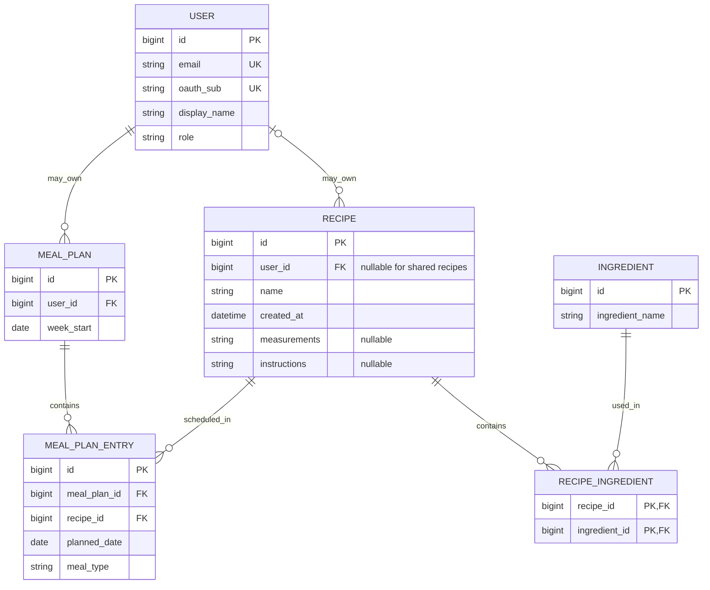

# <API name> Proposal

## 1. The pitch (one paragraph)
The Recipe and Meal Planner API allows users of our app to create, organize, and manage recipes and meal plans. Users can search through existing recipes as well as existing ingredients. The API stores recipes with their ingredients and cooking instructions. The Android app uses this API so users can save recipes, view their ingredients and instructions, and organize them into meal plans.

## 2. Resources
| Resource | Key fields | Relationships |
|---|---|---|
| Users | id, email, oauthSub, displayName, role | A User can own many Recipes and MealPlans. An ADMIN User can manage other Users. |
| Recipes | id, name, measurements, instructions | A Recipe can use many Ingredients and can appear in many MealPlanEntries. |
| Ingredients | id, ingredientName | An Ingredient can be used by many Recipes. |
| MealPlans | id, weekStart | A User owns many MealPlans. A MealPlan has many MealPlanEntries. |
| MealPlanEntries | id, mealPlanId, recipeId, plannedDate, mealType | Each entry belongs to one MealPlan and references one Recipe. |

## 3. ER sketch
Tables, primary and foreign keys, and cardinality. Edit this Mermaid diagram (it renders on GitHub;
try changes at https://mermaid.live):

## 4. Endpoints
| Verb | Path | Auth | Purpose |
|---|---|---|---|
| GET | /api/v1/recipes?page=0&size=20&sort=name,asc | user | List available recipes. Paginated and sortable by name or creation date. |
| POST | /api/v1/recipes | user | create a recipe with ingredients|
| GET | /api/v1/recipes/{recipeId} | user | view one recipe |
| PUT | /api/v1/recipes/{recipeId} | user | fully replace a recipe |
| PATCH | /api/v1/recipes/{recipeId} | user | partially update a recipe |
| DELETE | /api/v1/recipes/{recipeId} | user | delete a recipe |
|  GET | /api/v1/ingredients?page=0&size=20 | public | Browse ingredients, paginated. |
| POST | /api/v1/ingredients | user | Add a new ingredient. |
| GET | /api/v1/users/me | user | View the signed-in user's account. |
| DELETE | /api/v1/users/me | user | Delete the signed-in user's account and data. |
| GET | /api/v1/users?page=0&size=20 | admin | List all users, paginated. |
| GET | /api/v1/users/{userId} | admin | View one user. |
| PATCH | /api/v1/users/{userId} | admin | Grant or revoke the admin role. |
| DELETE | /api/v1/users/{userId} | admin | Delete a user and their data. |
| GET | /api/v1/meal-plans?page=0&size=20 | user | List the user's meal plans, paginated. |
| POST | /api/v1/meal-plans | user | Create a weekly meal plan. |
| GET | /api/v1/meal-plans/{mealPlanId} | user | View a meal plan and its entries. |
| PATCH | /api/v1/meal-plans/{mealPlanId} | user | Update a meal plan. |
| DELETE | /api/v1/meal-plans/{mealPlanId} | user | Delete a meal plan and its entries. |
| GET | /api/v1/meal-plans/{mealPlanId}/entries | user | List meals scheduled in a meal plan. |
| POST | /api/v1/meal-plans/{mealPlanId}/entries | user | Add a recipe to a meal plan. |
| PATCH | /api/v1/meal-plans/{mealPlanId}/entries/{entryId} | user | Update a scheduled meal. |
| DELETE | /api/v1/meal-plans/{mealPlanId}/entries/{entryId} | user | Remove a scheduled meal. |
| ... | ... | ... | ... |

Mark each endpoint `public`, `user`, or `admin`. Mark which collection paginates and which
filters or sorts.

## 5. Technical choices
- **Database host:** Neon (serverless PostgreSQL). Our data is relational (users, recipes,
  ingredients, meal plans, and join tables with foreign keys), so PostgreSQL fits better
  than a document store. Neon's free tier is enough for a class project, and every team
  member can connect to the same hosted database without running it locally.
- **OAuth2 provider:** Google. Google supports the Authorization Code flow with PKCE for
  native apps, which is what the Android app needs, and every user already has a Google
  account. The API acts as a resource server, validates the Google-issued token, and maps
  the token's subject ID to a User row.
- **Repo layout:** Split repos. This repo holds only the API, and the Android app lives in
  its own repo. The two are built, deployed, and tested independently and share only the
  OpenAPI contract (`docs/openapi.yaml`), so each team can work without blocking the other.

## 6. Risks
- One risk is that deleting or changing one of the objects could affect how another object acts, like deleting an ingredient in recipes. What we will do first to find out is to test how the API handles deletions or changes.
- Another risk is that a user could try to edit or view another user's mealplan or edit a lot of things on the API at once. What we could do to find out is to test what are the limits of a single user and figure out a workaround if an issue shows up.

## 7. Team and Sprint 1
Carlos Solian owns the 2 repos: 
- https://github.com/Solian21/CST438_P2_API 
- https://github.com/Solian21/CST438_P2_Andrioid_App

Doyoung Yang owns the Spring Boot.
Project Board: https://github.com/users/Solian21/projects/1/views/1
